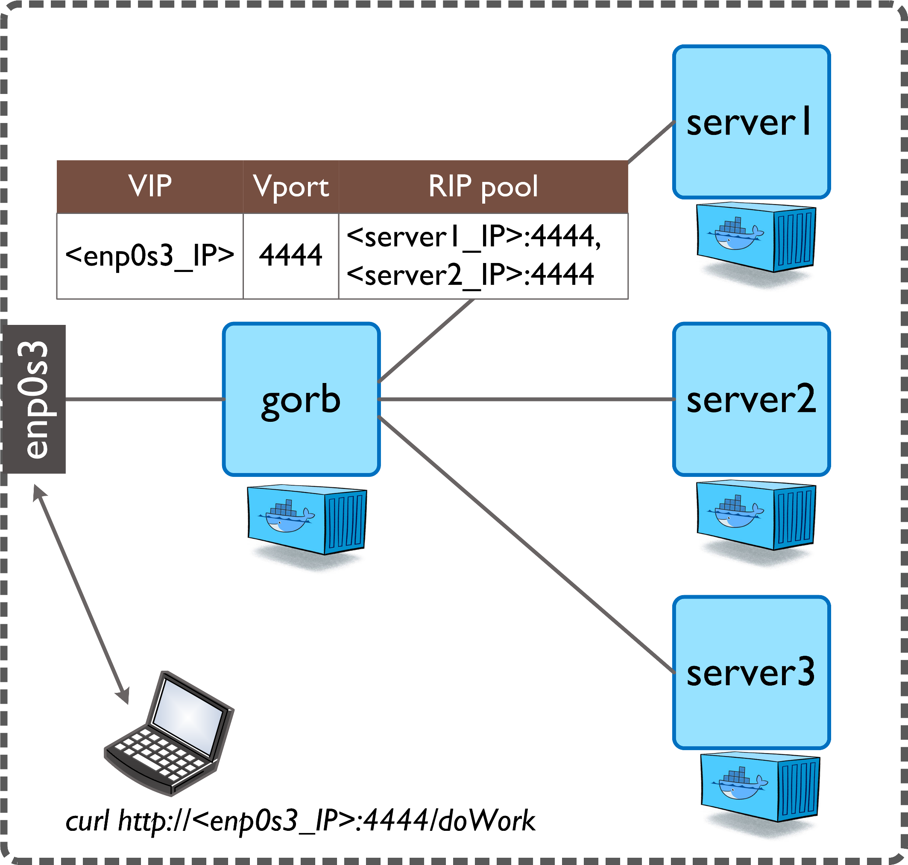

# Cloud Native Applications: Hands on

In this hands-on section we will introduce the second component of our cloud 
native application, Gorb load balancer.

Gorb is an IPVS frontend with a REST API interface. You can use it to control 
a local IPVS instance in the Kernel to dynamically register virtual services and 
backends.

In this section, we will use Gorb in the following setup in order to load balance 
requests towards the web server containers: 



## Part (1/3) Deploy Gorb load balancer


1. Load `ip_vs` module into Linux kernel  

   ```
   sudo modprobe ip_vs
   ```
2. Download gorb docker image  

   ```
   docker pull kobolog/gorb:latest
   ```
3. Run Gorb inside Docker  

   ```
   docker run --rm --name gorb --privileged --net=host -it kobolog/gorb -f -i enp0s3
   ```
   These command line options instruct IPVS to distribute incoming requests addressed to 
   the IP address bound to `enp0s3`.

## Part (2/3): Register services to the load balancer

In the previous hands on section we created 2 server containers

```
docker inspect server1
            ...
            "IPAddress": "172.17.0.2"
            ...

docker inspect server2
            ...
            "IPAddress": "172.17.0.3"
            ...
```

We'll use these containers as the Real Servers for our load balancer.

We also need to get the IP address of `enp0s3` interface. 
Here `IP_ADDR=10.0.2.15`  
```
ifconfig enp0s3
enp0s3 ...
    inet addr:10.0.2.15  Bcast:10.0.2.255  Mask:255.255.255.0
    ...
```

Now off to deploy Gorb

1. At first, we should create a new virtual service that gorb should perform load balancing for. 
   The virtual service will have as Virtual IP the IP address bound to `enp0s3`, virtual port 4444, and protocol "tcp". 
   Also, it will use Round-Robin distribution. 

   Replace `$IP_ADDR` with the IP address bound to enp0s3  

   ```
   curl -i -X PUT \
        -H "Content-Type: application/json" \
        -d '{"host":"$IP_ADDR", "port":4444, "protocol":"tcp", "method":"rr", "persistent": true}'  \
        http://$IP_ADDR:4672/service/0 
   ```
2. Register `server1` as a backend to the new service (if server1 has a different IP address, change the host value)  

   ```
   curl -i -X PUT \
        -H "Content-Type: application/json" \
        -d '{"host":"172.17.0.2", "port":4444, "method":"nat", "weight":100 }' \
        http://$IP_ADDR:4672/service/0/0
   ```
   
3. Modify the previous command to register `server2` 
   (Hint: change `service/0/0` to `service/0/1`)
   

## Part (3/3): Test load balancing

A simple way to think about how `IP_VS` achieves load balancing is that it hides
the backend application instances and it exposes the service (IP,port) tuple.

We can then send some packets to the backend through the service IP and port 
and IP_VS will route the packets to an instance, so that each instance handles 
a fair share of the traffic.

#### Test Manually
1. Perform multiple requests to the service (IP,port) (~10-15)  

   ```
   curl http://$IP_PORT:4444/doWork
   ```
2. Verify that each request returns successfully
3. Verify that `server1` has handled about half of these requests in the console 
   output.

### Test using client

We can now introduce the third component of our application, the client. Our 
client generates variable load by sending requests to our backend. This load 
changes randomly every few seconds.

1. Run client on baremetal. Replace `$IP_ADDR` with our IP.  

   ```
   go run client/main.go $IP_ADDR
   ```
2. Observe: only 2 instances can't handle all the requests the client sends
3. Observe: `server1` handles about half the requests


## Conclusions
- We used the `IP_VS` kernel module through Gorb's REST API to achieve dynamic 
  routing and load balancing for 2 instances of our application
- This provides us an out of the box scale-out mechanism that we will use to 
  create a CNA orchestrator
